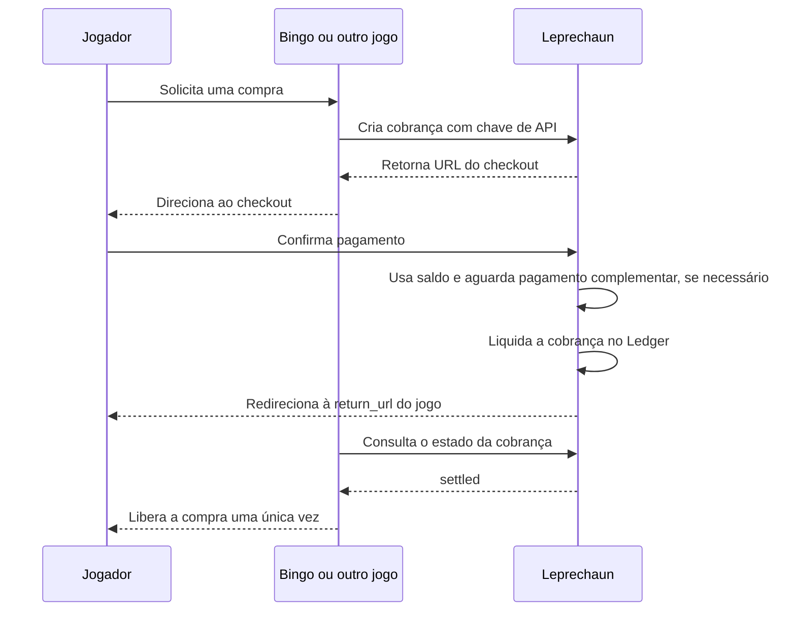

# Leprechaun

**Plataforma self-hosted para gerenciar saldos de usuários e pagamentos entre várias aplicações.**

O Leprechaun é uma base financeira para quem desenvolve sistemas que precisam
manter saldo de usuários, registrar movimentações e cobrar por produtos ou
serviços. Você hospeda a plataforma na sua própria infraestrutura e conecta suas
aplicações a uma carteira central, sem implementar uma carteira separada em cada
uma delas.

Uma loteria com vários jogos é um exemplo: bingo, rifas e outros jogos podem usar
o mesmo saldo do jogador e o mesmo checkout. Cada jogo continua responsável por
suas regras, pedidos e apostas; o Leprechaun centraliza as contas, as cobranças e
o registro financeiro. O mesmo modelo pode ser aplicado a outros sistemas que
precisem compartilhar saldo entre aplicações.

> **Em desenvolvimento:** o fluxo de integração está disponível para testes
> locais com pagamentos simulados. A versão atual ainda não está pronta para
> operar com fundos reais. Veja [Estado do projeto](#estado-do-projeto).

## Uma carteira, várias aplicações

Em uma instalação do Leprechaun, o operador pode:

- Manter uma conta de saldo por usuário, com saldo disponível, reservado e extrato.
- Cadastrar aplicações com chave de API e conta de recebimento próprias.
- Oferecer um checkout comum, com confirmação explícita do usuário.
- Combinar saldo interno e pagamento Lightning para completar uma compra.
- Administrar o acesso das aplicações, desativar integrações e trocar suas chaves.
- Conferir transações e reconciliar os registros financeiros no Ledger.

Self-hosted significa que o operador controla a implantação, os bancos de dados,
o provedor de identidade e a configuração dos serviços de pagamento. Também é
responsável pela operação, pelas credenciais, pelos backups e pela segurança
dessa infraestrutura. A configuração local usa Keycloak para autenticação OIDC e
LNbits com FakeWallet para simular pagamentos Lightning.

## Exemplo: uma loteria com bingo e outros jogos

O jogador se identifica no Leprechaun e tem uma conta de saldo associada à sua
identidade. O bingo e os demais jogos se conectam como aplicações independentes,
cada um com suas credenciais e pedidos. Quando o jogador compra uma cartela, o
bingo solicita uma cobrança e encaminha o jogador ao checkout compartilhado.



O jogo deve consultar a cobrança no servidor antes de liberar a cartela ou outro
produto. O retorno do navegador não comprova pagamento. A emissão da aposta, o
encerramento das vendas, os sorteios e a prevenção de emissão duplicada pertencem
à aplicação do jogo e precisam ser integrados ao fluxo financeiro.

## Como conectar uma aplicação

1. Cadastre a aplicação em `/admin/applications`, informando nome, identificador,
   site e conta de recebimento existente no Ledger.
2. Guarde a chave de API no servidor da aplicação.
3. Crie uma cobrança em `POST /api/checkout/sessions`, com o pedido, valor,
   identificação da aplicação e URLs de retorno e cancelamento.
4. Direcione o usuário à `checkout_url` retornada. Abrir essa URL não debita saldo:
   o usuário precisa confirmar o pagamento.
5. Após a liquidação, o checkout retorna automaticamente à `return_url`.
   Consulte a API e libere a compra somente quando o estado for `settled`.

Cada aplicação só pode consultar e cancelar suas próprias cobranças. O destino
financeiro e a origem das URLs devem corresponder ao cadastro. A API de aplicações
não permite debitar livremente o saldo de um usuário.

A confirmação para o jogo é feita por consulta à API; ainda não há webhook de
notificação para aplicações. Reenviar o mesmo pedido com os mesmos dados retorna
a mesma sessão de checkout.

Veja o [guia de integração de aplicações](docs/application-integration.md) para
exemplos de requisição, autenticação, estados e administração de chaves.

## Arquitetura

O sistema separa a experiência de pagamento, a contabilidade e a integração com
a rede de pagamentos:

| Componente | Responsabilidade |
| --- | --- |
| **Hub** | Interface web, autenticação OIDC, administração das aplicações e coordenação do checkout. |
| **Ledger** | Contas, saldos, reservas, transações, lançamentos e reconciliação financeira. |
| **PLS** | Payment Lightning Service: integração com LNbits, invoices, pagamentos e confirmação externa. |
| **RabbitMQ** | Transporte de comandos e eventos entre os serviços. |
| **PostgreSQL** | Persistência dos dados dos serviços. |
| **Prometheus** | Coleta de métricas operacionais. |

O **Ledger é a fonte de verdade dos saldos**. O Hub coordena a compra; o PLS
acompanha pagamentos Lightning e publica eventos. Uma compra liquidada debita a
conta do usuário e credita a conta de destino cadastrada para a aplicação.

O contrato Lightning usa as filas `payment.lightning.commands`,
`payment.lightning.events` e `payment.lightning.commands.dlq`. Os detalhes de
request/reply, eventos e consumo no Ledger estão no
[fluxo de pagamentos Lightning](docs/payment-lightning-flow.md).

## Executar localmente

Com Docker e Docker Compose disponíveis, execute na raiz do repositório:

```sh
docker compose --env-file .env.example -f compose.yaml -f compose.local.yaml up -d --build
```

Abra [localhost:8000](http://localhost:8000) e entre com `player` /
`local-player-password`. Essa configuração provisiona OIDC e pagamentos
simulados, usa saldos fictícios e mantém volumes separados para desenvolvimento.
Ela não é uma configuração de produção.

O [guia de desenvolvimento local](docs/local-development.md) explica o acesso
administrativo, o cadastro da aplicação de demonstração, a simulação de compras
e os comandos para inspecionar e parar os serviços.

Consulte [.env.example](.env.example) para as variáveis de configuração. Fora do
ambiente simulado, a conta de liquidação Lightning precisa existir no Ledger antes
de habilitar `PAYMENT_EVENT_CONSUMER_ENABLED`. Os serviços internos, incluindo
Ledger e PLS, devem ser acessados pela rede de serviços, não diretamente pelos jogos.

## Desenvolvimento e operação

A implementação utiliza Python 3.11+, FastAPI, NiceGUI, FastStream, SQLAlchemy
assíncrono e Poetry. Cada serviço possui seu próprio ambiente e testes.

Para executar os testes, entre em `hub`, `ledger` ou `pls` e execute:

```sh
poetry install
poetry run python -m pytest -q
```

Os testes de integração usam Testcontainers e precisam de acesso ao Docker.
Para conferir a contabilidade, execute na pasta `ledger`:

```sh
poetry run python -m ledger.reconcile
```

Ledger e PLS expõem `/metrics`; o PLS também expõe `/health` na porta interna
`8001`. A configuração de coleta está em
[prometheus/prometheus.yml](prometheus/prometheus.yml).

## Estado do projeto

Já estão implementados o cadastro de aplicações, a autenticação por chave de
API, o isolamento de cobranças por aplicação, o checkout com confirmação do
usuário, o retorno automático ao jogo e o fluxo local de pagamentos simulados.
O Ledger oferece reservas, lançamentos e reconciliação; o PLS mantém estado de
integração, idempotência e outbox. O fluxo local foi validado com testes
automatizados e compras simuladas de ponta a ponta.

Antes de operar com fundos reais, ainda é necessário concluir:

- Reserva prévia de saldo e recuperação durável de falhas no saque.
- Recuperação de liquidações parcialmente concluídas entre serviços.
- Validação de concorrência, reentrega de eventos e interrupções de serviços.
- Configuração e revisão de segurança da implantação, incluindo HTTPS,
  credenciais, permissões, backups e monitoramento.
- Integração da confirmação financeira com a entrega de cada aplicação,
  incluindo emissão única de apostas e tratamento de compras não emitidas.

O fluxo atual de saque envia o pagamento antes de registrar o débito. Essa
limitação precisa ser resolvida antes de habilitar saques com fundos reais.

## Documentação dos serviços

- [Hub](hub/README.md): interface, autenticação e checkout.
- [Ledger](ledger/README.md): contabilidade e operações financeiras.
- [Modelos do Ledger](ledger/ledger/models/description.md) e
  [rotas do Ledger](ledger/ledger/routes/description.md).
- [PLS](pls/README.md): serviço de pagamentos Lightning.
- [Modelos do PLS](pls/pls/models/description.md).
- [Contrato de pagamentos](docs/payment-lightning-flow.md).
- [Integração de aplicações](docs/application-integration.md).
- [Desenvolvimento local](docs/local-development.md).

## Contribuir e licença

O Leprechaun é distribuído sob a [licença MIT](LICENSE). Dependências e serviços
integrados mantêm suas próprias licenças.

Leia [CONTRIBUTING.md](CONTRIBUTING.md) para preparar o ambiente e submeter
alterações, [SECURITY.md](SECURITY.md) para relatar vulnerabilidades e
[operação self-hosted](docs/self-hosting.md) para os limites da implantação.

As verificações automatizadas executam testes e análise estática dos três
serviços. A pasta [local-bootstrap](local-bootstrap/README.md) prepara dados
fictícios para testes. **Não use o bootstrap em produção.**
